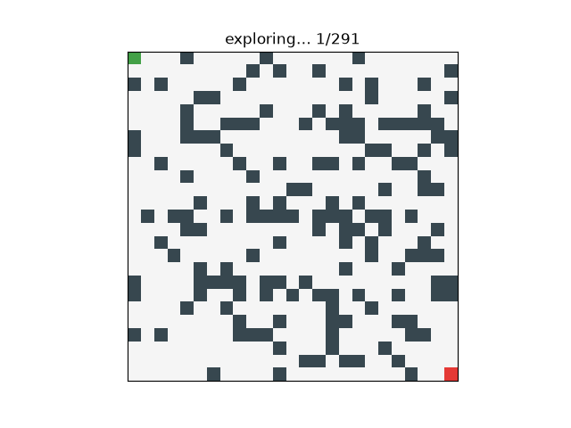

# graphfinder

<p align="center">
  <a href="https://pypi.org/project/graphfinder/"></a>
  <a href="https://crates.io/crates/graphfinder-core"></a>
  <a href="https://github.com/graphfinder/graphfinder.github.io/actions/workflows/ci.yml"></a>
  <a href="https://graphfinder.github.io/"></a>
  
  
</p>

<p align="center">
  
  <br>
  <em>A* exploring a maze — blue is the expanded frontier, gold is the final
  path. Rendered with <code>graphfinder.viz.animate_grid</code>.</em>
</p>

A general-purpose, extensible **graph traversal & pathfinding** library with a
**Rust** core, covering both **uninformed** search (BFS, DFS, UCS/Dijkstra) and
**informed** search (Greedy, A\*, Weighted A\*). Sibling project to
[turboswarm](https://github.com/turboswarm); its design priorities are, in
order: **visualization, algorithm comparison, code clarity** and performance.

Built for **teaching**: every algorithm ships a runnable example and a test that
asserts its defining property.

> The Rust core, the Python API (via PyO3/maturin) **and** the visualization
> layer are complete and tested. See the [roadmap](ROADMAP.md) for what's next
> (performance/scale, implicit puzzles, road networks).

## The one idea

Every algorithm here is the **same loop** (Russell & Norvig's GENERAL-SEARCH),
differing only in the **frontier** and the evaluation function
`priority = g_coeff·g(n) + h_coeff·h(n)`:

| Algorithm   | Frontier        | `g_coeff` | `h_coeff` | Optimal? |
|-------------|-----------------|-----------|-----------|----------|
| BFS         | FIFO queue      | 1 | 0 | only on unit costs |
| DFS         | LIFO stack      | 1 | 0 | no |
| UCS/Dijkstra| min-priority    | 1 | 0 | yes |
| Greedy      | min-priority    | 0 | 1 | no |
| **A\***     | min-priority    | 1 | 1 | yes (admissible h) |
| Weighted A\*| min-priority    | 1 | w | w-bounded |

## Quickstart (Rust)

```rust
use graphfinder_core::{search, Algorithm, GridGraph, Manhattan};

let (grid, start, goal) = GridGraph::from_ascii(
    "S....\n.###.\n...#.\n.#.#.\n.#..G",
);
let r = search(&grid, start, goal, Algorithm::astar(), &Manhattan, true);
println!("cost={} expanded={}", r.cost, r.nodes_expanded);
```

```bash
cargo run --example basic   -p graphfinder-core   # A* draws its path on a maze
cargo run --example compare -p graphfinder-core   # all algorithms, side by side
cargo test  -p graphfinder-core
```

## Quickstart (Python)

```bash
pip install maturin && maturin develop --release
```

```python
import graphfinder as gf

r = gf.search(gf.sample_maze("wall"), algorithm="astar", heuristic="manhattan")
print(r)                       # SearchResult(found=True, cost=20, expanded=25, ...)

# explicit graph from a generator, bidirectional search
edges = gf.gen_barabasi_albert(300, 3, seed=7)
gf.search_graph(300, edges, 0, 299, algorithm="bidirectional")

# implicit graph: reach 27 from 1 via +1 and *2 (BFS = fewest ops)
gf.search(lambda s: [(s+1, 1.0), (s*2, 1.0)] if s < 100 else [],
          start=1, goal=27, algorithm="bfs").path   # [1, 2, 3, 6, 12, 13, 26, 27]
```

`compare` prints, for one maze:

```
algorithm        cost  optimal?  expanded  frontier
----------------------------------------------------
BFS                20       yes        25         3
DFS                22        no        23         3
UCS                20       yes        25         3
Greedy             20       yes        23         5
A*                 20       yes        25         3
Weighted A*        20       yes        25         5
```

## What it includes

- **Uninformed:** BFS, DFS, UCS / Dijkstra, depth-limited (DLS), iterative
  deepening (IDDFS), bidirectional BFS.
- **Informed:** Greedy best-first, A\*, Weighted A\*, IDA\*, beam search.
- **Run control:** optional node-expansion budget (`search_with`) with an
  explicit `stop_reason`.
- **Domains:** `GridGraph` (2-D maze worlds, ASCII maps, 4/8-connected, **per-cell
  terrain cost**), `CsrGraph` (explicit weighted graphs in cache-friendly CSR
  layout), and seeded random-graph generators (Erdős–Rényi, Barabási–Albert,
  Watts–Strogatz).
- **Heuristics:** Zero (uninformed), Manhattan, Euclidean, Octile, **or your own
  callable** `h(node, goal) -> float` (works in any domain).
- **Instrumentation for visualization & comparison:** every run reports the
  path, cost, `nodes_expanded`, `nodes_generated`, `max_frontier_size`,
  `stop_reason`, and a per-step `trace` (the expansion order — replay it to
  animate the search).
- **Visualization** (`graphfinder.viz`, Python): `animate_grid` (the maze-search
  animation above), `plot_grid` (static snapshot, terrain-shaded), `plot_costs`
  (terrain heatmap), `plot_frontier` (memory profile), `compare` (work-vs-quality
  bar charts), `plot_graph` (general graph coloured by search state).
- **Integrations** (`graphfinder.integrations`): **NetworkX**, **SciPy** sparse
  adjacency, **pandas** edge-list DataFrames, **OSMnx** road networks (geographic
  A\*), and a safe **LangChain** routing tool. Optional extras:
  `pip install graphfinder[networkx]`.
- **Reproducibility:** seeded random maze generator; deterministic tie-breaking.

## How is this different from networkx / rustworkx?

Those are excellent general graph libraries. graphfinder's niche — like
turboswarm's — is **traversal/search pedagogy, step-by-step visualization and
algorithm comparison**, with performance and GIL-free implicit state-space
search (puzzles, large grids) as supporting features rather than the headline.

## License

MIT © 2026 Jose L. Salmeron
